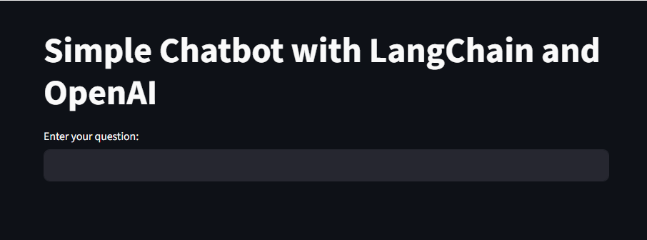

# LangChain Chatbot

A simple yet powerful chatbot application built with LangChain and Streamlit, featuring support for both OpenAI GPT models and local Ollama models.


_Interactive Streamlit web interface for the LangChain chatbot_

## Table of Contents

- [Features](#features)
- [Prerequisites](#prerequisites)
- [Installation](#installation)
- [Configuration](#configuration)
- [Usage](#usage)
- [Available Models](#available-models)
- [Project Structure](#project-structure)
- [Environment Variables](#environment-variables)
- [Troubleshooting](#troubleshooting)
- [Contributing](#contributing)
- [License](#license)

## Features

- **Multiple LLM Support**: Choose between OpenAI GPT models and local Ollama models
- **Interactive Web Interface**: Built with Streamlit for easy interaction
- **LangSmith Integration**: Built-in tracing and monitoring capabilities
- **Modular Design**: Clean separation between OpenAI and Ollama implementations
- **Environment Configuration**: Secure API key management with `.env` files
- **Real-time Responses**: Instant chatbot responses in the web interface

## Prerequisites

Before running this application, ensure you have:

- **Python 3.8+** installed on your system
- **OpenAI API Key** (for GPT models) or **Ollama** installed locally
- **LangSmith API Key** (optional, for tracing and monitoring)

## Installation

1. **Clone the repository:**

   ```bash
   git clone <repository-url>
   cd langchain/Chatbot
   ```

2. **Create a virtual environment:**

   ```bash
   python -m venv .venv
   ```

3. **Activate the virtual environment:**

   - **Windows:**
     ```bash
     .venv\Scripts\activate
     ```
   - **macOS/Linux:**
     ```bash
     source .venv/bin/activate
     ```

4. **Install required packages:**
   ```bash
   pip install langchain-openai langchain-core langchain-community streamlit python-dotenv
   ```

## Configuration

1. **Create a `.env` file** in the project root:

   ```env
   OPENAI_API_KEY=your-openai-api-key-here
   LANGCHAIN_API_KEY=your-langsmith-api-key-here
   LANGCHAIN_TRACING_V2=true
   ```

2. **For Ollama setup** (if using local models):
   - Install Ollama from [https://ollama.ai](https://ollama.ai)
   - Pull the required model: `ollama pull llama2`

## Usage

### Running with OpenAI GPT Models

```bash
streamlit run app.py
```

### Running with Ollama Local Models

```bash
streamlit run ollama.py
```

The application will start on `http://localhost:8501` by default.

## Available Models

### OpenAI Models (app.py)

- **GPT-3.5-turbo**: Fast, cost-effective model for general conversations

### Local Models (ollama.py)

- **Llama2**: Meta's open-source language model running locally
- **Customizable**: Easy to switch to other Ollama-supported models

## Project Structure

```
Chatbot/
├── .env                 # Environment variables (create this)
├── .venv/              # Virtual environment
├── app.py              # Main app with OpenAI integration
├── ollama.py           # Alternative app with Ollama integration
└── README.md           # Project documentation
```

## Environment Variables

| Variable               | Description              | Required         | Default |
| ---------------------- | ------------------------ | ---------------- | ------- |
| `OPENAI_API_KEY`       | Your OpenAI API key      | Yes (for OpenAI) | None    |
| `LANGCHAIN_API_KEY`    | Your LangSmith API key   | No               | None    |
| `LANGCHAIN_TRACING_V2` | Enable LangSmith tracing | No               | `true`  |

## Troubleshooting

### Common Issues

1. **"str expected, not NoneType" Error**

   - Ensure your `.env` file exists and contains valid API keys
   - Check that environment variables are loaded before use

2. **Module Import Errors**

   - Verify all required packages are installed: `pip list`
   - Ensure virtual environment is activated

3. **Ollama Connection Issues**

   - Verify Ollama is running: `ollama list`
   - Check if the model is pulled: `ollama pull llama2`

4. **Streamlit Port Issues**
   - Use a different port: `streamlit run app.py --server.port 8502`

### Getting Help

If you encounter issues:

1. Check the terminal output for error messages
2. Verify your API keys and environment setup
3. Ensure all dependencies are correctly installed

## Contributing

Contributions are welcome! Please feel free to submit a Pull Request. For major changes:

1. Fork the repository
2. Create a feature branch (`git checkout -b feature/AmazingFeature`)
3. Commit your changes (`git commit -m 'Add some AmazingFeature'`)
4. Push to the branch (`git push origin feature/AmazingFeature`)
5. Open a Pull Request

## License

This project is licensed under the MIT License - see the LICENSE file for details.

---

## Quick Start

```bash
# 1. Clone and navigate
git clone <repo-url> && cd langchain/Chatbot

# 2. Set up environment
python -m venv .venv && .venv\Scripts\activate

# 3. Install dependencies
pip install langchain-openai langchain-core langchain-community streamlit python-dotenv

# 4. Create .env file with your API keys

# 5. Run the app
streamlit run app.py
```

---

**Built with ❤️ using LangChain and Streamlit**
