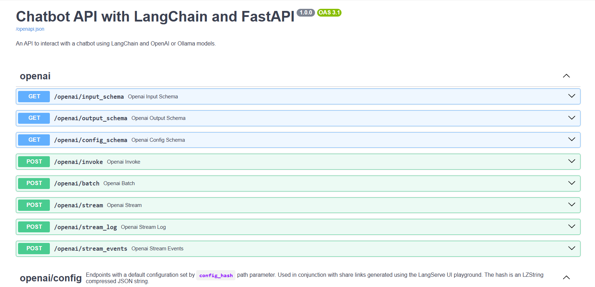
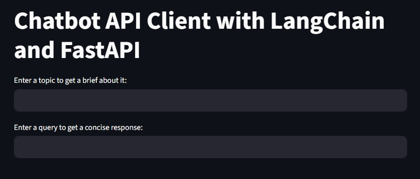

# LangChain FastAPI Server

A RESTful API server built with FastAPI and LangChain that provides multiple chatbot endpoints using OpenAI GPT models and Ollama.



## Project Scope

This API provides three main endpoints for LLM interactions:

- Direct OpenAI chat interface
- Brief topic explanations (under 100 words)
- Concise assistant responses

## API Endpoints

### Base URL: `http://localhost:8000`

| Endpoint   | Method | Description                                   | Input Format                         |
| ---------- | ------ | --------------------------------------------- | ------------------------------------ |
| `/openai`  | POST   | Direct OpenAI chat interface                  | Standard LangServe format            |
| `/brief`   | POST   | Brief explanations about topics (< 100 words) | `{"input": {"topic": "your_topic"}}` |
| `/concise` | POST   | Concise assistant responses                   | `{"input": "your_query"}`            |

### Interactive Documentation

- **Swagger UI**: `http://localhost:8000/docs`
- **ReDoc**: `http://localhost:8000/redoc`


_FastAPI automatically generates interactive API documentation with Swagger UI_

## Quick Start

1. **Set up environment variables** (create `.env` file):

   ```env
   OPENAI_API_KEY=your_openai_api_key_here
   ```

2. **Run the server**:

   ```bash
   python app.py
   ```

3. **Test the API**:
   ```bash
   curl -X POST "http://localhost:8000/brief/invoke" \
     -H "Content-Type: application/json" \
     -d '{"input": {"topic": "artificial intelligence"}}'
   ```

## Project Files

- `app.py` - FastAPI server with LangChain integration
- `client.py` - Streamlit demo client for testing endpoints
- `README.md` - This documentation

## Configuration

### Models Used

- **OpenAI**: GPT-3.5-turbo (temperature=0)
- **Ollama**: Llama2 (temperature=0) - configured but not exposed

### Environment Variables

- `OPENAI_API_KEY` - Required for OpenAI endpoints

## Client Usage Example

### Using the Streamlit Client

```bash
streamlit run client.py
```

### Using Python Requests

```python
import requests

# Brief topic explanation
response = requests.post(
    "http://localhost:8000/brief/invoke",
    json={"input": {"topic": "machine learning"}}
)
print(response.json()['output'])

# Concise response
response = requests.post(
    "http://localhost:8000/concise/invoke",
    json={"input": "What is Python?"}
)
print(response.json()['output'])
```

## Technical Details

- **Framework**: FastAPI with LangServe
- **LLM Integration**: LangChain with OpenAI
- **Server**: Uvicorn ASGI server
- **Port**: 8000 (configurable)
- **Host**: 0.0.0.0 (accepts external connections)

---

**Built for educational purposes demonstrating FastAPI + LangChain integration**
