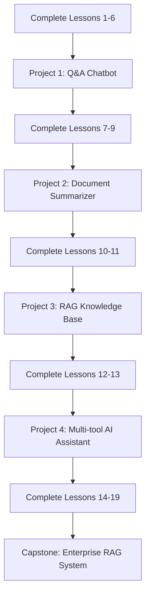

# Hands-on Projects

Learn by building! These projects are designed to reinforce the concepts you learn in the curriculum through practical, hands-on development.

## Mini Projects

### Project 1: Simple Q&A Chatbot
**Prerequisites**: Lessons 1-6  
**Duration**: 2-3 hours  
**Skills**: Basic LangChain, Prompt Engineering, LLM Integration

Build a conversational chatbot that can answer questions using a language model. Learn the fundamentals of LangChain while creating your first AI application.

[**→ View Project Details**](project-1-chatbot/)

---

### Project 2: Document Summarization Tool
**Prerequisites**: Lessons 1-9  
**Duration**: 3-4 hours  
**Skills**: Document Processing, Text Splitting, Summarization Chains

Create a tool that can summarize long documents, research papers, or articles. Learn how to handle different document formats and implement effective summarization strategies.

[**→ View Project Details**](project-2-summarizer/)

---

### Project 3: RAG-powered Knowledge Base
**Prerequisites**: Lessons 1-11  
**Duration**: 4-5 hours  
**Skills**: RAG Implementation, Vector Stores, Embeddings, Retrieval

Build a knowledge base system that can answer questions based on your own documents. Implement Retrieval-Augmented Generation to create accurate, context-aware responses.

[**→ View Project Details**](project-3-rag-kb/)

---

### Project 4: Multi-tool AI Assistant
**Prerequisites**: Lessons 1-13  
**Duration**: 5-6 hours  
**Skills**: Agents, Tool Integration, Function Calling, Complex Workflows

Develop an AI assistant that can use multiple tools like calculators, web search, and APIs to solve complex problems. Learn advanced agent patterns and tool orchestration.

[**→ View Project Details**](project-4-ai-assistant/)

---

## Capstone Project

### Enterprise RAG System
**Prerequisites**: Complete Curriculum  
**Duration**: 2-3 weeks  
**Skills**: Production Deployment, Multi-modal RAG, Advanced Optimization, Testing

Build a production-ready, enterprise-grade RAG system with advanced features like:

- Multi-modal document processing (text, images, tables)
- Advanced retrieval strategies and re-ranking
- User authentication and access control
- Performance monitoring and analytics
- Scalable deployment architecture
- Comprehensive testing and evaluation

[**→ View Capstone Details**](capstone-enterprise-rag/)

---

## 🎓 Project Learning Path

---

## Project Guidelines

### Before You Start
- Complete the prerequisite lessons
- Set up your development environment
- Review the project requirements and goals
- Fork/clone the starter code repository

### During Development
- Follow the step-by-step instructions
- Test your code frequently
- Document your implementation decisions
- Experiment with different approaches

### After Completion
- Review and refactor your code
- Test edge cases and error scenarios
- Deploy your project (if applicable)
- Write a brief reflection on what you learned

---

## Sharing Your Work

We encourage you to share your project implementations:

- **GitHub**: Create a public repository with your code
- **Blog Posts**: Write about your experience and learnings
- **Community**: Share in our discussions and help others
- **Showcase**: Submit exceptional projects for our showcase section

---

## Getting Help

Stuck on a project? Here's how to get help:

1. **Review the Documentation**: Check the lesson materials and project guides
2. **Search Issues**: Look for similar problems in our GitHub issues
3. **Ask Questions**: Create a new issue with your specific question
4. **Community Discussion**: Join our community discussions for peer support

---

**Ready to start building? Choose your first project and let's code! 🚀**